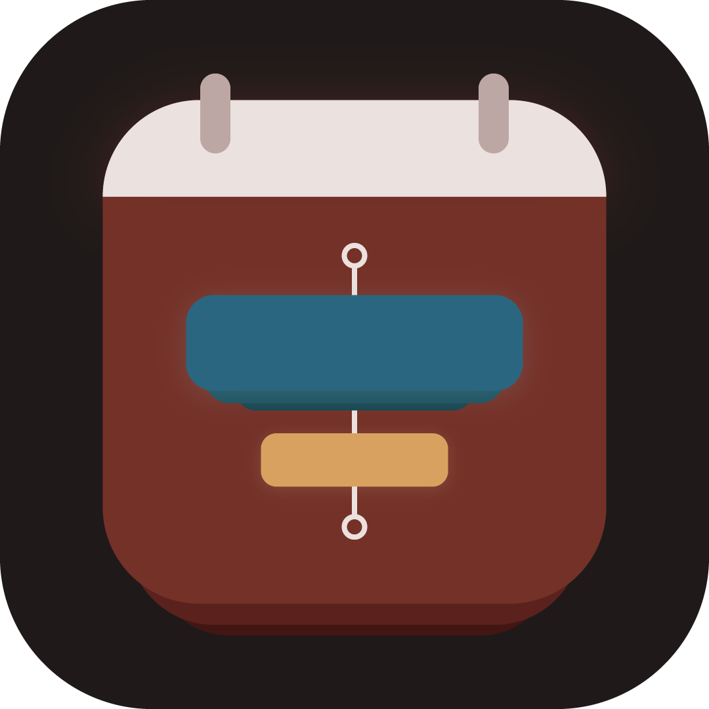
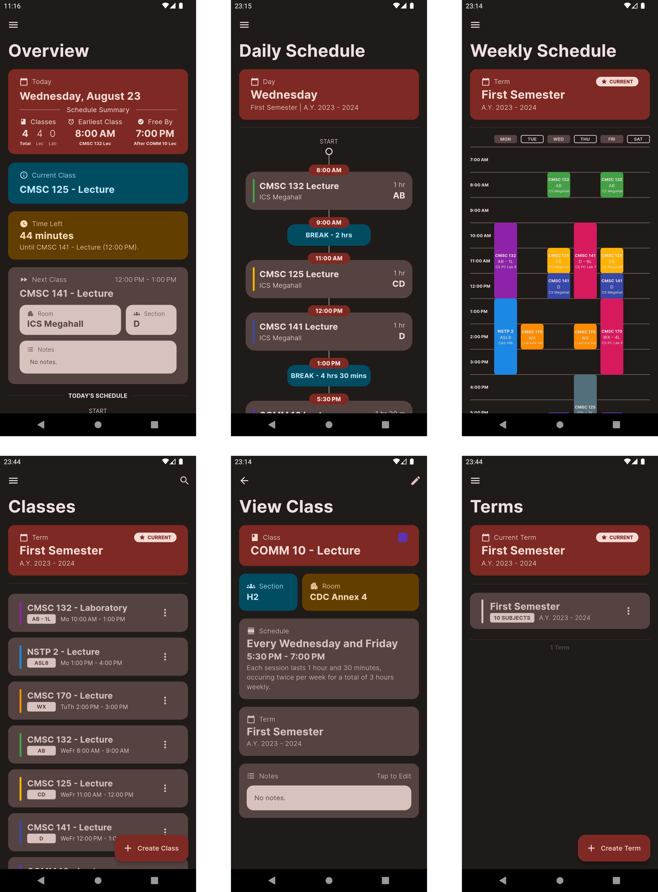

  
  <h1>Course Planner</h1>
  
A course planner that helps you plan your courses.

  
  
  
  

   
  
  

<h2>
  Preview
</h2>

    

<h2>
  Feature Summary
</h2>

- **Organize Your Classes:** Group your classes by term, making it easy to manage your academic schedule.
- **Weekly Timetable:** View your classes in a weekly timetable layout, helping you plan your week efficiently.
- **Comprehensive Daily Schedule:** Access a detailed daily schedule that provides a clear overview of your class timings.
- **All-in-One Overview:** Get an overview that consolidates all the essential information you need for your classes.
- **Overlap Checker:** Includes a built-in checker to prevent scheduling conflicts by identifying overlapping class times.
- **Fully Offline:** Enjoy the convenience of using the app without requiring an active internet connection, ensuring your data is always accessible.

<h2>
  Install
</h2>
Choose one of the following methods to install the app:

- **Compile from Source:**

  Clone this repository and compile the project from scratch.

- **For Android:**

   Download the latest `apk` from the releases page.
  > Minimum Android version: v4.1 (Jellybean)

- **For iOS (Note: Requires Extra Steps):**

  Since I don't have an Apple Developer account (they cost a lot!!!), I am unable to upload this app to App Store and installing the app on iOS requires a few extra steps. You can sideload the app using the provided `ipa` on the releases page. Alternatively, run the project on your iOS device in release mode using Flutter CLI.

  Please keep in mind that this method might be trickier due to Apple's limitations on sideloading apps.

<h2>
  Contribute
</h2>

Feel free to contribute to my terrible code! Just submit a PR and I will review them whenever I am available.
